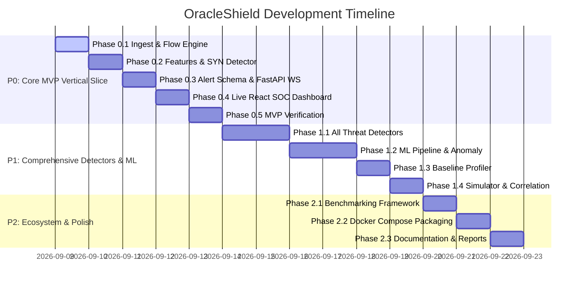

# Implementation Plan — OracleShield: Passive AI Threat Intelligence Engine

Build **OracleShield**, a robust, demonstrable prototype of an AI/ML-powered passive cyber threat detection platform for unidirectional network monitoring enclaves. The system passively ingests PCAP/streaming network traffic, aggregates flows using canonical bidirectional 5-tuple keys with directional tracking, computes rich statistical and behavioral features, baseline profiles host behavior, executes multi-layer AI/ML threat detectors, surfaces evidence-first alerts, and visualizes live threat intelligence on a SOC-style dark-mode dashboard.

---

## 1. Architectural Guardrails & Passive Boundary

> [!IMPORTANT]
> **Strict Read-Only / Unidirectional Constraints**
> - Zero return path: Software components possess no mechanism or network socket capability to transmit packets back to monitored networks.
> - Passive intelligence: No active probing, no inline blocking, no TCP handshakes, no firewall or mitigation commands.
> - No payload decryption: TLS/QUIC application payloads remain encrypted. Intelligence is derived strictly from packet headers, packet sizes, inter-arrival timing, entropy, SNI, cipher suite metadata, and flow dynamics.
> - Explicit fingerprinting distinction: Actual JA3/JA4 fingerprints (when raw ClientHello parameters are available) are handled distinctly from general TLS/QUIC metadata (SNI, cipher suites, record lengths). Metadata parsing handles missing/encrypted fields gracefully without throwing errors.

```mermaid
flowchart TD
    subgraph Monitored Production Network
        PROD[Production Network Traffic]
    end

    DIODE[Data Diode / Passive Mirror]
    PROD -->|One-Way Link| DIODE

    subgraph Monitoring Enclave (OracleShield - Robust Prototype)
        direction TB
        ING[Ingestion Engine: PCAP / Replay]
        FLOW[Canonical Bidirectional Flow Aggregator]
        FEAT[Feature & Entropy Extraction Engine]
        BASE[Baseline & Behavior Profiling Engine]
        DET[Multi-Layer Threat Detectors]
        RISK[Ensemble Risk Engine & Correlation]
        DB[(Database: SQLite / PostgreSQL)]
        WS[WebSocket Server]
        DASH[SOC Security Dashboard & Threat Investigation]

        DIODE -->|READ-ONLY Packets| ING
        ING --> FLOW
        FLOW --> FEAT
        FEAT --> BASE
        FEAT --> DET
        BASE --> DET
        DET --> RISK
        RISK --> DB
        RISK --> WS
        WS --> DASH
    end
```

---

## 2. Updated Repository & Code Base Layout

```text
oracle-shield/
├── simulator/                      # Controlled threat & normal traffic generators
│   ├── traffic_generator.py        # Master synthetic traffic generator
│   ├── normal_traffic.py           # Benign HTTP/DNS/SSH/TLS flow synthesizer
│   └── attack_generators/          # Modular attack flow generators
│       ├── syn_flood.py
│       ├── udp_flood.py
│       ├── udp_reflection.py
│       ├── port_scan.py
│       ├── host_scan.py
│       ├── c2_beacon.py
│       ├── dga.py
│       ├── dns_tunnel.py
│       └── exfiltration.py
├── ingest/                         # Packet ingestion & streaming
│   ├── pcap_reader.py              # Incremental generator PCAP reader & replay
│   ├── replay.py                   # PCAP Replay CLI with speed control (--speed)
│   ├── stream.py                   # Async packet event stream
│   └── models.py                   # Raw packet metadata models
├── flows/                          # Canonical Flow aggregation & sliding windowing
│   ├── flow_key.py                 # Canonical bidirectional 5-tuple key & direction tracking
│   ├── flow_manager.py             # Incremental flow state & active/idle timeouts
│   └── window.py                   # Configurable sliding windows (1s, 5s, 10s, 30s)
├── features/                       # Feature engineering & baseline profiling
│   ├── network_features.py         # Packet sizes, counts, rates, direction ratios
│   ├── statistical_features.py     # Mean, std, CoV, skewness, min/max
│   ├── temporal_features.py        # Inter-arrival times, burstiness, periodicity
│   ├── dns_features.py             # Shannon entropy, subdomains, n-grams, record types
│   ├── tls_features.py             # SNI, cipher suites, packet length sequences, JA3/JA4 parsing
│   ├── baseline_profiler.py        # Host & service behavioral baseline profiler
│   └── feature_pipeline.py        # Unified feature vector builder
├── detection/                      # Threat detection modules
│   ├── base_detector.py            # Base detector abstract interface
│   ├── ddos_detector.py            # SYN flood & UDP amplification detector
│   ├── scanning_detector.py        # Vertical & horizontal scan detector
│   ├── beacon_detector.py          # Periodic C2 beacon detector
│   ├── dga_detector.py             # DGA domain classifier
│   ├── dns_tunnel_detector.py      # DNS covert channel detector
│   ├── encrypted_malware_detector.py # Encrypted traffic behavioral detector
│   ├── exfiltration_detector.py    # Outbound volume & asymmetry detector
│   ├── anomaly_detector.py        # Isolation Forest baseline anomaly detector
│   └── ensemble.py                 # Central risk engine & correlation rules
├── models/                         # ML models & training pipelines
│   ├── training/                   # Model training scripts
│   │   ├── dataset_builder.py      # Time/session based dataset splitter (no data leakage)
│   │   ├── train_all.py            # Master offline model trainer
│   │   ├── train_ddos.py
│   │   ├── train_c2.py
│   │   ├── train_dga.py
│   │   ├── train_scanning.py
│   │   └── train_anomaly.py        # Isolation Forest trainer
│   ├── trained/                    # Serialized joblib model files
│   └── preprocessing/              # Scalers, encoders, feature list definitions
├── alerts/                         # Alert schema & evidence generator
│   ├── schema.py                   # Pydantic Alert, Evidence, & Feature Importance models
│   ├── generator.py                # Alert generation & deduplication
│   └── severity.py                 # Severity & confidence mapping
├── backend/                        # FastAPI Web Server & REST API
│   ├── main.py                     # FastAPI application entrypoint
│   ├── database.py                 # SQLAlchemy async engine & models
│   ├── websocket.py                # Broadcast WebSocket endpoint `/ws/alerts`
│   └── api/                        # REST routes
│       ├── alerts.py
│       ├── flows.py
│       ├── statistics.py
│       └── models.py
├── dashboard/                      # React SOC Frontend (Vite + TypeScript + Tailwind)
│   ├── src/
│   │   ├── components/             # KPI Cards, Live Alert Feed, Threat Investigation Drawer, Charts
│   │   ├── hooks/                  # WebSocket & API custom hooks
│   │   ├── types/                  # TypeScript interfaces matching backend schemas
│   │   └── App.tsx
│   ├── package.json
│   ├── tailwind.config.js
│   └── vite.config.ts
├── tests/                          # Pytest suite
│   ├── test_ingest.py
│   ├── test_flows.py
│   ├── test_features.py
│   ├── test_detection.py
│   └── test_api.py
├── benchmarks/                     # Throughput & latency benchmark framework
│   ├── throughput.py               # Flows/sec and P95/P99 latency benchmarks
│   └── reports/
├── configs/
│   └── config.yaml                 # Externalized thresholds, windows, weights
├── docker-compose.yml
├── Dockerfile.backend
├── Dockerfile.frontend
├── requirements.txt
└── README.md
```

---

## 3. Key Technical Specifications & Architectural Refinements

### A. Canonical Bidirectional 5-Tuple Key & Direction Tracking
- **Flow Key Formulation**:
  ```python
  # Canonical key ensures packets from A:1234 -> B:80 and B:80 -> A:1234 map to the exact same Flow instance
  endpoints = sorted([(src_ip, src_port), (dst_ip, dst_port)])
  canonical_key = (endpoints[0][0], endpoints[0][1], endpoints[1][0], endpoints[1][1], protocol)
  ```
- **Explicit Direction Preservation**:
  - The initial packet defining the flow establishes the `initiator` (forward direction).
  - Packets matching `(initiator_ip, initiator_port) -> (responder_ip, responder_port)` increment `fwd_packets`, `fwd_bytes`, and forward TCP flags (e.g. initial `SYN`).
  - Return packets increment `rev_packets`, `rev_bytes`, and reverse TCP flags (e.g. `SYN-ACK`).
  - Forward vs reverse directionality is directly made available to:
    - **SYN Flood**: Checks ratio of `fwd_syn` to `rev_syn_ack`.
    - **UDP Amplification**: Checks asymmetric `rev_bytes / fwd_bytes` ratios.
    - **C2 Beaconing**: Analyzes initiator outbound connection timing.
    - **Exfiltration**: Measures `fwd_bytes` (upload) vs `rev_bytes` (download).

### B. TLS & QUIC Metadata (Without Payload Decryption)
- Direct parsing of unencrypted ClientHello / ServerHello fields (SNI, cipher suites, supported extensions, record lengths, inter-packet arrival times).
- Explicit distinction: Actual **JA3/JA4 fingerprints** (when ClientHello bytes are present and parsed) vs **Derived TLS/QUIC Metadata** (SNI string, cipher count, packet length sequence vectors).
- Robust fallback handling: Gracefully handles non-TLS traffic, encrypted handshake variants, or missing SNI without raising exceptions or dropping flows.

### C. Baseline & Behavior Profiling Engine (`features/baseline_profiler.py`)
- Maintains rolling statistical baselines per host IP / service port over sliding historical windows (e.g., mean connections/min, typical byte ratios, typical dest host fan-out).
- Calculates statistical deviations ($Z = \frac{x - \mu}{\sigma}$) and percentiles for incoming flow features.
- Serves as an auxiliary feature provider to anomaly detectors, exfiltration detectors, and the unknown threat layer.

### D. Leakage-Free ML Training & Evaluation Pipeline
- **Dataset Splitting**: Split datasets strictly by session, capture file, or temporal block (`dataset_builder.py`), ensuring flows from the same IP/session do not appear in both train and test splits.
- **Evaluation Metrics**:
  - Compute and log: Precision, Recall, F1-Score, False-Positive Rate (FPR), False-Negative Rate (FNR), Confusion Matrix, and Average Inference Latency ($\text{ms/flow}$).
  - All reported metrics in documentation and UI model views will be directly computed from actual model evaluation runs (zero fabricated metrics).

### E. Evidence-First Threat Investigation View
- When an alert is selected in the SOC Dashboard, the **Threat Investigation Drawer** presents:
  1. **Threat Summary**: Threat class, Severity badge, Confidence meter (e.g. 94%), Timestamp, Flow ID.
  2. **Flow 5-Tuple**: Source IP/port, Destination IP/port, Protocol, Duration, Total Bytes & Packets (Fwd/Rev split).
  3. **Model Attributions**: Model name & version (e.g., `c2-random-forest-v1.0`), model type (Supervised RF / Statistical Rule / Isolation Forest).
  4. **Contributing Features**: Rank-ordered list of top contributing features (e.g. `periodicity_score = 0.96`, `interarrival_std = 0.42s`).
  5. **Supporting Evidence**: Human-readable context (e.g., "Observed 120 regular connections at 30-second intervals to a single rare external IP").
  6. **Related Correlated Events**: Other recent alerts involving the same source or destination host.

---

## 4. Prioritized Execution Roadmap



### P0 Priority — Vertical Slice MVP Milestone
> [!IMPORTANT]
> **MVP Verification Goal**
> Establish a fully functional end-to-end data pipeline prior to expanding detector breadth:
> `PCAP → Streaming Reader → Flow Aggregator → Feature Extraction → SYN Flood / Scan / C2 Detectors → Alert Schema → FastAPI → Live Dashboard`

1. **Ingest & Flow Aggregation**: `pcap_reader.py` (incremental iterator), `flow_key.py` (canonical bidirectional 5-tuple with direction tracking), `flow_manager.py` (5s sliding window).
2. **Feature Extraction**: Basic flow features + packet rate/size statistics + temporal IAT.
3. **P0 Detectors**:
   - `ddos_detector.py` (SYN flood & UDP flood).
   - `scanning_detector.py` (Vertical & horizontal scan).
   - `beacon_detector.py` (Periodic C2 beaconing heuristic).
4. **Alert Schema & Engine**: Pydantic schemas in `alerts/schema.py`, alert generator with evidence output.
5. **Backend & WebSocket**: FastAPI server with `/api/alerts`, `/api/flows`, `/api/statistics`, and `/ws/alerts`.
6. **SOC Dashboard**: Vite + React + TypeScript dark-mode interface with live WebSocket feed, KPI cards, and Threat Investigation view.

### P1 Priority — Complete Threat Intelligence Suite & ML
1. **Remaining Threat Detectors**:
   - `dga_detector.py` (DGA domain classifier using entropy, length, n-grams).
   - `dns_tunnel_detector.py` (DNS tunneling detector using query entropy, subdomain volume, TXT records).
   - `encrypted_malware_detector.py` (TLS/QUIC metadata & sequence classifier).
   - `exfiltration_detector.py` (Outbound volume & asymmetric upload detector).
2. **ML Pipeline & Anomaly Layer**:
   - Leakage-free dataset builder (`dataset_builder.py`).
   - Supervised Random Forest / XGBoost training scripts (`models/training/`).
   - Unsupervised Isolation Forest anomaly detector (`anomaly_detector.py`) for unknown threat identification (`UNKNOWN_ANOMALY`).
3. **Baseline Profiling Engine**: `features/baseline_profiler.py` tracking rolling host behavior and supplying Z-score deviation features.
4. **Synthetic Threat Simulator**: `simulator/traffic_generator.py` and `simulator/demo.py` for automated multi-threat playback.
5. **Correlation Engine**: Correlating multi-vector alerts across common IPs in `detection/ensemble.py`.

### P2 Priority — Benchmarking, Containerization & Documentation
1. **Benchmarking Suite**: `benchmarks/throughput.py` measuring flows/sec, packets/sec, CPU/RAM, and P95/P99 latency under heavy synthetic load.
2. **Docker Packaging**: `Dockerfile.backend`, `Dockerfile.frontend`, and `docker-compose.yml`.
3. **Comprehensive Documentation**: Complete `README.md` with Mermaid architecture diagrams, model evaluation reports, and setup guides.

---

## 5. Verification Plan

### Automated Testing
- `pytest tests/` covering:
  1. Bidirectional flow key canonicalization and direction preservation.
  2. Incremental PCAP reading and sliding window expiry.
  3. Feature extraction accuracy (entropy math, inter-arrival time statistics, baseline Z-scores).
  4. Detector unit tests (SYN flood, C2 periodicity, DGA domain scoring, DNS tunneling, scan detection).
  5. FastAPI REST endpoints & WebSocket JSON broadcast.

### MVP End-to-End Verification
- Run `python -m simulator.demo` to emit P0 attack flows (SYN flood, Port scan, C2 beacon).
- Verify real-time alert push via WebSocket to the React SOC Dashboard.
- Open the Threat Investigation Drawer and verify:
  - Severity, Confidence, and 5-Tuple metadata.
  - Model attribution (`syn-flood-heuristic-v1.0` / `c2-beacon-rf-v1.0`).
  - Exact top contributing features and supporting evidence metrics.

### Throughput & Latency Verification
- Execute `python -m benchmarks.throughput` under simulated traffic rates (500 to 5,000 flows/sec).
- Record and verify that processing latency remains bounded with P95 < 50ms.
